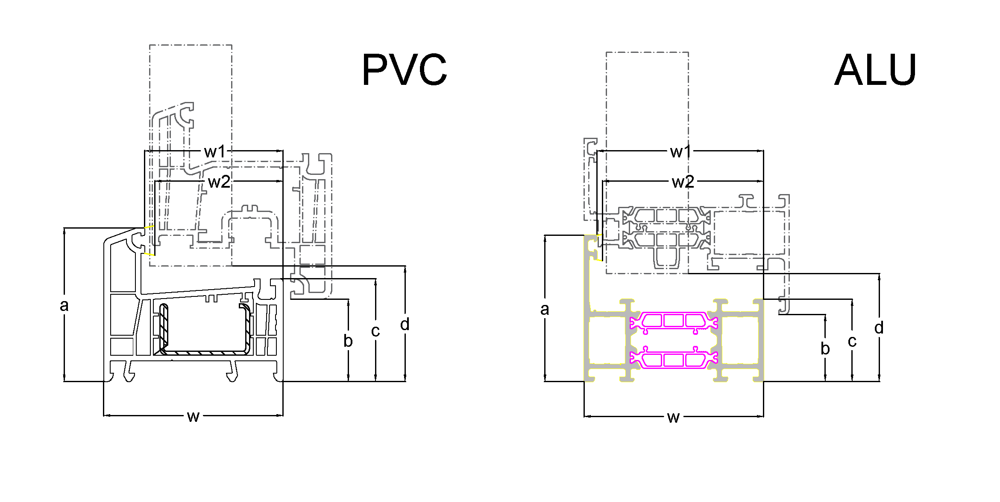
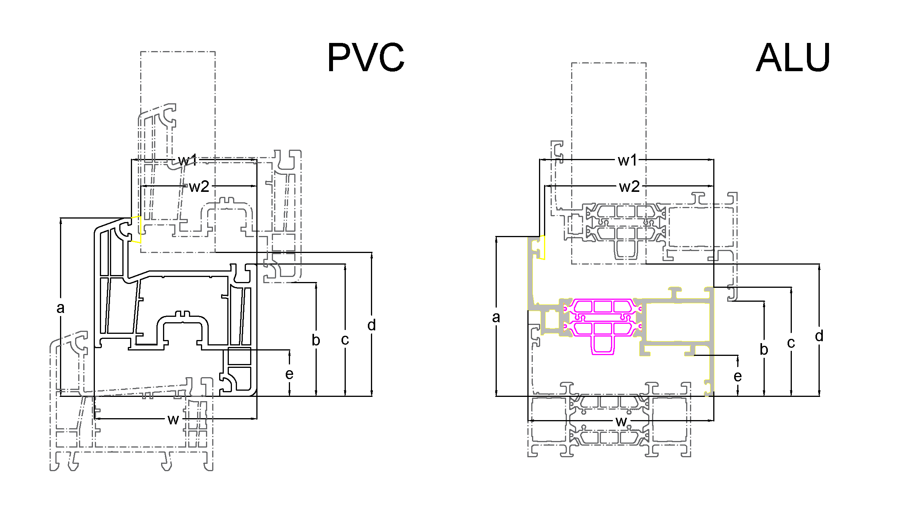
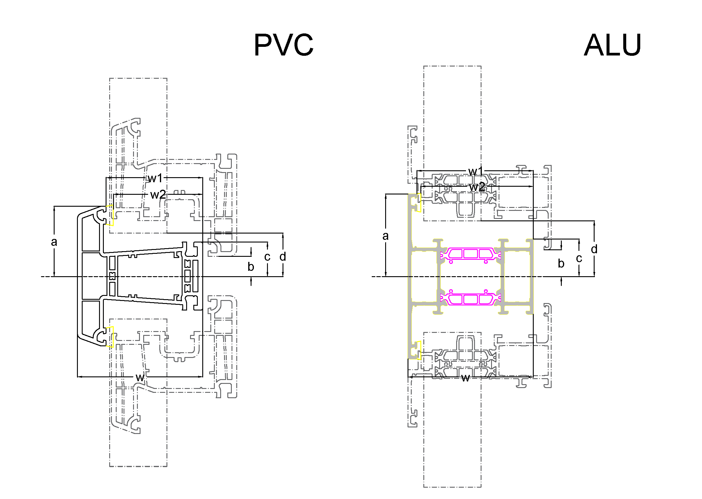
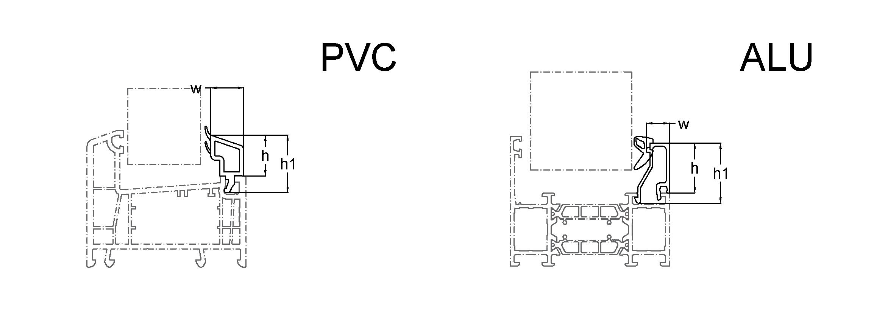
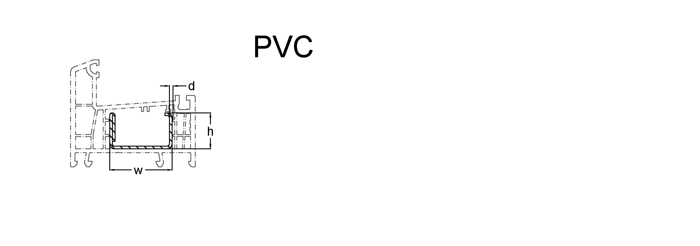
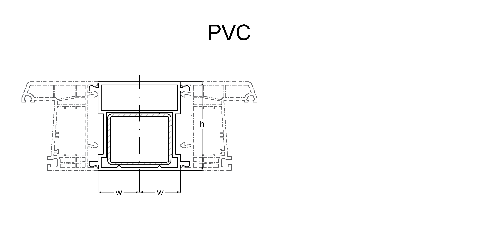
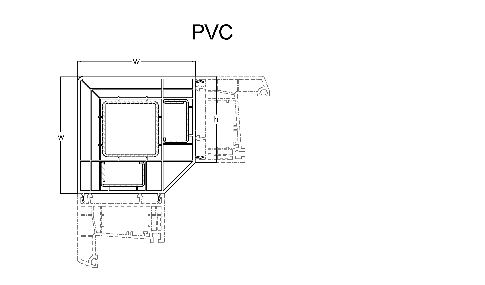
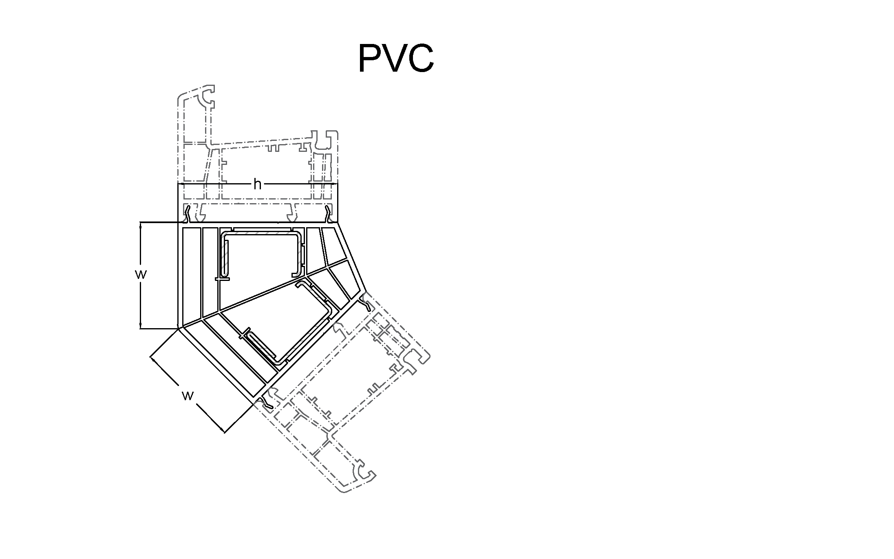
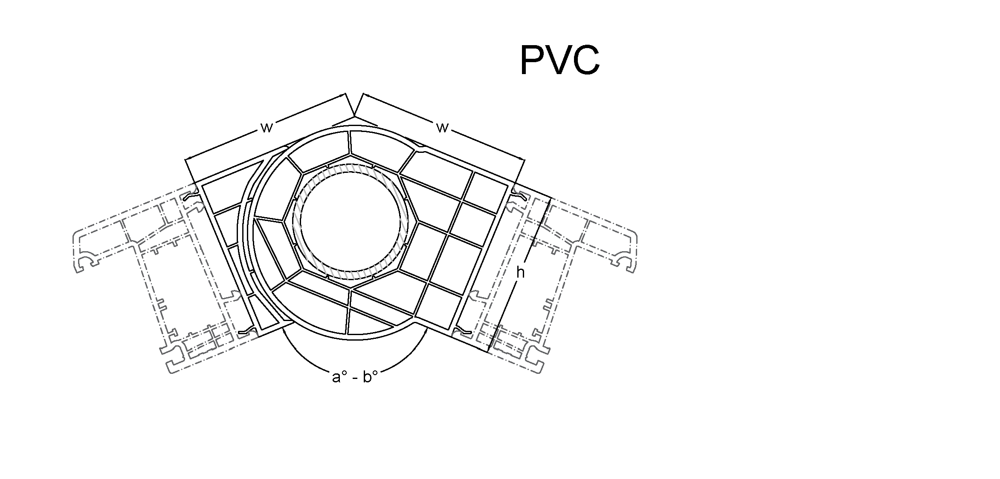

# The OpenWin Specification <!-- omit in toc -->

#### Version 1.0

This document is licensed under [The Apache License, Version 2.0](https://www.apache.org/licenses/LICENSE-2.0.html).

## Введение <!-- omit in toc -->

Спецификация OpenWinSpec (OWS) определяет стандартное, не зависящее от языка программирования, описание модели заказа (Windows Order Model - WOM), характерной для описания данных во время взаимоотношений между участниками рынка светопрозрачных конструкций, которое позволяет людям и компьютерам понимать его (заказа) структуру, не требуя доступа к специфическому программному обеспечению и дополнительной документации. При правильном определении через OpenWinSpec передаваемые данные между субъектами, характерных для отрасли бизнес-процессов, всегда однозначно интерпретируются и могут, без ущерба для содержательной части, быть преобразованы в обе стороны любой из поддерживающих стандарт электронной системой.

Модель заказа не обязательно должна содержать описание конструкций, но обязана содержать минимальные характеристики заказа, которые должны быть сколь-нибудь информативными для участников бизнес-процесса, использующими данное описание. В общем случае это означает, что для долгосрочной идентификации одной и той же сущности, как минимум, может быть использован ее уникальный идентификатор.

Определения OpenWin могут быть использованы для создания документации, средств автоматической генерации документов OpenWin на любых языках программирования, библиотеках проверки документов, инструментах тестирования и в других случаях.

## Содержание <!-- omit in toc -->

<!-- TOC depthFrom:1 depthTo:3 withLinks:1 updateOnSave:1 orderedList:0 -->

- [Определения](#definitions)
  - [Документ OpenWin](#owDocument)
- [Спецификация](#specification)
  - [Версионирование](#versions)
  - [Формат](#format)
  - [Структура документа](#documentStructure)
  - [Типы данных](#dataTypes)
  - [Схема](#schema)
    - [OpenWin Object](#owObject)
    - [Info Object](#infoObject)
    - [Definitions Object](#definitionsObject)
    - [Dictionary Object](#dictionaryObject)
    - [Vendor Object](#vendorObject)
      - [Vendor Type](#vendorType)
      - [Vendor Material](#vendorMaterial)
    - [Profile System Object](#profileSystemObject)
    - [Profile Object](#profileObject)
      - [Profile Type](#profileType)
    - [Geometry Objects](#geometryObjects)
    - [Point Object](#pointObject)
    - [Construction Object](#constructionObject)
    - [Connection Object](#constructionObject)
    - [Element Object](#elementObject)
    - [Component Object](#componentObject)
    - [Beam Object](#beamObject)
    - [Beam Cutting Object](#beamCuttingObject)
    - [Glazing Bead Feature Object](#glazingBeadFeatureObject)
    - [Filling Feature Object](#fillingFeatureObject)
    - [Filling Type Feature Object](#fillingTypeFeatureObject)
    - [Virtual Feature Object](#virtualFeatureObject)

<!-- /TOC -->

## <a name="definitions"></a>Определения

### <a name="owDocument"></a>Документ OpenWin

Файл или другой подобный ресурс, представляющий собой Автономное и независимое от других документов универсальное описание данных модели заказа WOM. Документ должен содержать, как мнимум, поля [id](#documentId) и [definitions](#documentDefinitions). Кроме того, [версия документа](#documentVersion) должна быть обязательно определена.

## <a name="specification"></a>Спецификация

### <a name="versions"></a>Версионирование

The OpenWin Specification is versioned using a `major`.`minor`.`patch` versioning scheme. The `major`.`minor` portion of the version string (for example `1.0`) SHALL designate the OAS feature set. _`.patch`_ versions address errors in, or provide clarifications to, this document, not the feature set. Tooling which supports OWS 1.0 SHOULD be compatible with all OWS 1.0.\* versions. The patch version SHOULD NOT be considered by tooling, making no distinction between `1.0.0` and `1.0.1` for example.

Occasionally, non-backwards compatible changes may be made in `minor` versions of the OWS where impact is believed to be low relative to the benefit provided.

An OpenWin document compatible with OWS 1.\*.\* contains a required [`openWinVersion`](#owVersion) field which designates the version of the OWS that it uses.

### <a name="format"></a>Формат

An OpenWin document that conforms to the OpenWin Specification is itself a JSON object, which may be represented either in JSON or YAML format.

For example, if a field has an array value, the JSON array representation will be used:

```json
{
  "field": [1, 2, 3]
}
```

All field names in the specification are **case sensitive**.
This includes all fields that are used as keys in a map, except where explicitly noted that keys are **case insensitive**.

The schema exposes two types of fields: Fixed fields, which have a declared name, and Patterned fields, which declare a regex pattern for the field name.

Patterned fields MUST have unique names within the containing object.

In order to preserve the ability to round-trip between YAML and JSON formats, YAML version [1.2](https://yaml.org/spec/1.2/spec.html) is RECOMMENDED along with some additional constraints:

- Tags MUST be limited to those allowed by the [JSON Schema ruleset](https://yaml.org/spec/1.2/spec.html#id2803231).
- Keys used in YAML maps MUST be limited to a scalar string, as defined by the [YAML Failsafe schema ruleset](https://yaml.org/spec/1.2/spec.html#id2802346).

### <a name="documentStructure"></a>Структура документа

Документ OpenWin должен быть единственным и самодостаточным документом, все ссылки должны быть исключительно внутренними

### <a name="dataTypes"></a>Типы данных

## <a name="schema"></a>Схема

In the following description, if a field is not explicitly REQUIRED or described with a MUST or SHALL, it can be considered OPTIONAL.

### <a name="owObject"></a>OpenWin Object

Это корневой объект [Документа OpenWin](#документ-openwin)

##### Fixed Fields

| Field Name                                   |                     Type                     | Description                                                                                                                                                                                                                                              |
| -------------------------------------------- | :------------------------------------------: | -------------------------------------------------------------------------------------------------------------------------------------------------------------------------------------------------------------------------------------------------------- |
| <a name="documentId"></a>id                  |                    `guid`                    | **REQUIRED**. Это строка является уникальным идентификатором данной модели и используется для долгосрочной модификации данных в контексте одной меняющейся во времени сущности, используемой в бизнес-процессе                                           |
| <a name="documentVersion"></a>openwinversion |                   `string`                   | **REQUIRED**. This string MUST be the [version number](#versions) of the OpenWin Specification that the OpenWin document uses. The `openwinversion` field SHOULD be used by tooling to interpret the OpenWin document.                                   |
| <a name="owsInfo"></a>info                   |          [Info Object](#infoObject)          | Объект предоставляет дополнительную [информацию](#infoObject) о модели заказа, которая может быть использована при необходимости, например уникальный идентификатор или сведения о локализации                                                           |
| <a name="owsDefinitions"></a>definitions     |  [[Definitions Object](#definitionsObject)]  | Определение [параметров заказа](#definitionsObject). Содержит минимлаьно необходимую информацию для идентификации заказа не только по [уникальному идентификатору](#documentId) заказа                                                                   |
| <a name="owsDictionaries"></a>dictionaries   |   [[Dictionary Object](#dictionaryObject)]   | Массив [справочников](#dictionaryObject) в заказе. Содержит все справочники, необходимые для более полного описания, прежде всего, конструкций в заказе, например, характеристики вендоров, описание систем и материалов                                 |
| <a name="owsConstructions"></a>constructions | [[Construction Object](#constructionObject)] | Массив [конструкций](#constructionObject) в заказе. Если не содержит элементов предполагается, что даный заказ не имеет достаточно информации для определения предмета бизнес-процесса, но содержит достаточно информации для его начала или продолжения |

### <a name="infoObject"></a>Info Object

Объект предоставляет дополнительную информацию о модели заказа, которая может быть использована при необходимости, например уникальный идентификатор или сведения о локализации

##### Fixed Fields

| Field Name                  |   Type   | Description                                                                                                                                                                                                    |
| --------------------------- | :------: | -------------------------------------------------------------------------------------------------------------------------------------------------------------------------------------------------------------- |
| <a name="documentId"></a>id |  `guid`  | **REQUIRED**. Это строка является уникальным идентификатором данной модели и используется для долгосрочной модификации данных в контексте одной меняющейся во времени сущности, используемой в бизнес-процессе |
| <a name="locale"></a>locale | `string` | Информация о локализации по умолчанию, применяемой для отображения и преобразования символьных строк модели, если это не описано дополнительно в описании конкретных полей                                     |

##### Info Object Example

```json
{
  "id": "787e08ae-0278-4eb4-8488-5ce5a660f91a",
  "locale": "RU"
}
```

```yaml
id: 787e08ae-0278-4eb4-8488-5ce5a660f91a
locale: RU
```

### <a name="definitionsObject"></a>Definitions Object

Определение параметров заказа

### <a name="dictionaryObject"></a>Dictionary Object

Определение справочников модели

##### Fixed Fields

| Field Name                          |                Type                | Description                                                                                                                                                            |
| ----------------------------------- | :--------------------------------: | ---------------------------------------------------------------------------------------------------------------------------------------------------------------------- |
| <a name="dictProfiles"></a>profiles | [[Profile Object](#profileObject)] | Массив описания [профилей](#profileObject), используемых в заказе. Если не содержит элементов, предполагается, что заказ не содержит информацию о применяемых профилях |

### <a name="vendorObject"></a>Vendor Object

Справочник поставщиков

##### Fixed Fields

| Field Name                          |            Type            | Description                                                                   |
| ----------------------------------- | :------------------------: | ----------------------------------------------------------------------------- |
| <a name="vendorId"></a>id           |          `number`          | **REQUIRED**. ID элемента, используется для ссылки из связанных объектов      |
| <a name="vendorType"></a>vendorType | [Vendor Type](#vendorType) | **REQUIRED**. Тип поставщика, см. описание объекта [Vendor Type](#vendorType) |

#### <a name="vendorType"></a>Vendor Types

Объект, определяющий тип [поставщика](#vendorObject), необходимо учитывать при связывании справочников, например, профилей

##### <a name="profileTypeValues"></a> Object values

В спецификации определены следующие возможные типы [поставщиков](#vendorObject):

- Profile

  Профили и профильные системы

- Hardware

  Фурнитура

- Metall

  Армирование

- Glass

  Стекла

- Spacer

  Дистанционная рамка

- Glazing

  Стеклопакеты

- Panel

  Панели и заполнения

#### <a name="vendorMaterial"></a>Vendor Material

Объект, определяющий артикул из справочников по классификации [поставщика](#vendorObject), используется для однозначной связи элемента справочника, например, профиля, с артикулом в учетной системе поставщика.

##### Fixed Fields

| Field Name                          |   Type   | Description                                              |
| ----------------------------------- | :------: | -------------------------------------------------------- |
| <a name="vendorId"></a>vendorId     | `number` | **REQUIRED**. ID поставщика                              |
| <a name="vendorArticle"></a>article | `string` | **REQUIRED**. Номер артикул в учетной системе поставщика |
| <a name="vendorName"></a>name       | `string` | Наименование артикула в учетной системе поставщика       |

#### <a name="profileSystem"></a>Profile System Object

Объект, определяющий профильную систему [поставщика](#vendorObject).

##### Fixed Fields

| Field Name                                   |   Type   | Description                                    |
| -------------------------------------------- | :------: | ---------------------------------------------- |
| <a name="profileSystemId"></a>id             | `number` | **REQUIRED**. ID профильной системы            |
| <a name="profileSystemVendorId"></a>vendorId | `number` | **REQUIRED**. ID поставщика профильной системы |
| <a name="profileSystemName"></a>name         | `string` | **REQUIRED**. Название профильной системы      |

### <a name="profileObject"></a>Profile Object

Информация о профилях, используемых в модели

##### Fixed Fields

| Field Name                                           |                Type                | Description                                                                                |
| ---------------------------------------------------- | :--------------------------------: | ------------------------------------------------------------------------------------------ |
| <a name="profileId"></a>id                           |              `number`              | **REQUIRED**. ID элемента, используется для ссылки из связанных объектов                   |
| <a name="profileVendorArticle"></a>vendorArticle     | [Vendor Material](#vendorMaterial) | **REQUIRED**. Обозначение артикула в учетной системе поставщика                            |
| <a name="profileType"></a>profileType                |    [Profile Type](#profileType)    | **REQUIRED**. Тип профиля, см. описание объекта [Profile Type](#profileType)               |
| <a name="profileProfileSystemId"></a>profileSystemId |  [Profile System](#profileSystem)  | **REQUIRED**. ID профильной системы, см. описание объекта [Profile System](#profileSystem) |
| <a name="profileSizeA"></a>a                         |              `number`              | Системный размер **a**                                                                     |
| <a name="profileSizeA"></a>b                         |              `number`              | Системный размер **b**                                                                     |
| <a name="profileSizeA"></a>c                         |              `number`              | Системный размер **c**                                                                     |
| <a name="profileSizeA"></a>d                         |              `number`              | Системный размер **d**                                                                     |
| <a name="profileSizeA"></a>e                         |              `number`              | Системный размер **e**                                                                     |
| <a name="profileSizeA"></a>w                         |              `number`              | Системный размер **w**                                                                     |
| <a name="profileSizeA"></a>w1                        |              `number`              | Системный размер **w1**                                                                    |
| <a name="profileSizeA"></a>w2                        |              `number`              | Системный размер **w2**                                                                    |
| <a name="profileSizeA"></a>h                         |              `number`              | Системный размер **h**                                                                     |
| <a name="profileSizeA"></a>h1                        |              `number`              | Системный размер **h1**                                                                    |

#### <a name="profileType"></a>Profile Type

Объект, определяющий тип [профиля](#profileObject) с точки зрения назначения для производства оконных блоков и конструкций

##### <a name="profileTypeValues"></a> Object values

В спецификации определены следующие возможные типы [профилей](#profileObject):

- Рама

  

  Размеры объекта

  | Размер | Описание                                                               |
  | :----: | :--------------------------------------------------------------------- |
  |   a    | Высота                                                                 |
  |   b    | Перекрытие створки                                                     |
  |   c    | Внутренняя высота                                                      |
  |   d    | Размер стеклопакета                                                    |
  |   w    | Системная глубина                                                      |
  |   w1   | Размер по фальцу                                                       |
  |   w2   | Размер по фальцу с учетом коэкструдированного / протянутого уплотнения |

- Створка открывание вовнутрь

  

  Размеры объекта

  | Размер | Описание                                                               |
  | :----: | :--------------------------------------------------------------------- |
  |   a    | Высота                                                                 |
  |   b    | Перекрытие створки                                                     |
  |   c    | Внутренняя высота                                                      |
  |   d    | Размер стеклопакета                                                    |
  |   f    | Высота наплава со стороны фурнитурного паза                            |
  |   w    | Системная глубина                                                      |
  |   w1   | Размер по фальцу                                                       |
  |   w2   | Размер по фальцу с учетом коэкструдированного / протянутого уплотнения |

- Створка открывание наружу

- Импост

  

  Размеры объекта

  | Размер | Описание                                                               |
  | :----: | :--------------------------------------------------------------------- |
  |   a    | Высота                                                                 |
  |   b    | Перекрытие створки                                                     |
  |   c    | Внутренняя высота                                                      |
  |   d    | Размер стеклопакета                                                    |
  |   w    | Системная глубина                                                      |
  |   w1   | Размер по фальцу                                                       |
  |   w2   | Размер по фальцу с учетом коэкструдированного / протянутого уплотнения |

- Штапик

  

  Размеры объекта

  | Размер | Описание         |
  | :----: | :--------------- |
  |   h    | Высота в профиле |
  |   h1   | Высота общая     |
  |   w    | Ширина           |

- Армирование

  

  Размеры объекта

  | Размер | Описание |
  | :----: | :------- |
  |   h    | Высота   |
  |   w    | Ширина   |
  |   d    | Толщина  |

- Штульп
- Соединительный профиль

  Виды соединительных профилей

  Соединительный профиль 180-180 град.
  

  Соединительный профиль 90-90 град.
  

  Соединительный профиль 135-135 град.
  

  Соединительный профиль 90-180 град.
  

  Размеры объекта

  | Размер | Описание                         |
  | :----: | :------------------------------- |
  |   h    | Высота                           |
  |   w    | Ширина                           |
  |   a    | Минмальный угол поворота, град   |
  |   b    | Максимальный угол поворота, град |

### <a name="constructionObject"></a>Construction Object

Определение конструкций в заказе

##### Fixed Fields

&nbsp;&nbsp;

| Field                                                     |   Type   | Description                                                                                                 |
| --------------------------------------------------------- | :------: | ----------------------------------------------------------------------------------------------------------- |
| <a name="constructionObjectId"></a>id                     | `number` | **REQUIRED** ID конструкции                                                                                 |
| <a name="constructionObjectRoughOpening"></a>roughOpening | `??????` | Описание проема, куда будет вставлена конструкция                                                           |
| <a name="constructionObjectElements"></a>elements         | `array`  | Массив объектов, описывающих элементы конструкции (Элементом конструкции является окно, дверь, добор и т.д) |
| <a name="constructionObjectConnections"></a>connections   | `array`  | Массив соединителей элементов конструкции (не понимаю зачем их выделяли в отдельную сущность)               |

&nbsp;

---

### <a name="connectionObject"></a>Connection Object

Определение соединителя в заказе

##### Fixed Fields

&nbsp;&nbsp;

| Field                                           |   Type   | Description                                                |
| ----------------------------------------------- | :------: | ---------------------------------------------------------- |
| <a name="connectionObjectId"></a>id             | `number` | **REQUIRED** ID соединителя                                |
| <a name="connectionObjectGeometry"></a>geometry | `??????` | Описание Segment                                           |
| <a name="connectionObjectProfile"></a>profile   | `??????` | **REQUIRED** Элемент профильной системы с типом Connection |
| <a name="connectionObjectCutting"></a>cutting   | `??????` | Тип соединения балок в элементе конструкции                |

&nbsp;

---

### <a name="elementObject"></a>Element Object

Определение элемента в заказе

##### Fixed Fields

&nbsp;&nbsp;

| Field                                                  |   Type   | Description                                                                                                                                                                                                                                                                            |
| ------------------------------------------------------ | :------: | -------------------------------------------------------------------------------------------------------------------------------------------------------------------------------------------------------------------------------------------------------------------------------------- |
| <a name="elementObjectId"></a>id                       | `number` | **REQUIRED** ID элемента                                                                                                                                                                                                                                                               |
| <a name="elementObjectElementType"></a>elementType     | `??????` | Тип элемента                                                                                                                                                                                                                                                                           |
| <a name="elementObjectProfileSystem"></a>profileSystem | `??????` | Профильная система используемая в элементе конструкции                                                                                                                                                                                                                                 |
| <a name="elementObjectGeometry"></a>geometry           | `array`  | **REQUIRED** Массив всех полигонов в элементе конструкции (полигон описание замкнутого многоугольника состоящего из сегментов-отрезков)                                                                                                                                                |
| <a name="elementObjectSplitters"></a>splitters         | `array`  | Массив всех разделителей в элементе конструкции (разделитель описывается сегментом-отрезком)                                                                                                                                                                                           |
| <a name="elementObjectComponents"></a>components       | `array`  | Массив компонентов конструкции (например окно содержит первый компонент Рама. Рама может может содержать компоненты Заполнение(стеклопакет и штапики) или Импост(разделяет полигон рамы на два полигона) или Створка. Каждый компонент может содержать еще какие то компоненты и т.д.) |

&nbsp;

---

### <a name="componentObject"></a>Component Object

Определение компонента в заказе

##### Fixed Fields

&nbsp;&nbsp;

| Field                                                    |   Type   | Description                        |
| -------------------------------------------------------- | :------: | ---------------------------------- |
| <a name="componentObjectComponentType"></a>componentType | `??????` | Тип компонента конструкции         |
| <a name="componentObjectFeature"></a>features            | `??????` | Тип элемента                       |
| <a name="componentObjectGeometryId"></a>geometryId       | `??????` | Ссылка на элемент массива полигона |
| <a name="componentObjectSplitterId"></a>splitterId       | `??????` | Ссылка на элемент массива сплитера |
| <a name="componentObjectProfile"></a>profile             | `??????` | Ссылка на профиль                  |
| <a name="componentObjectBeams"></a>beams                 | `array`  | Массив объектов описывающих балки  |
| <a name="componentObjectComponents"></a>components       | `array`  | Массив вложенных объектов          |

&nbsp;

---

### <a name="beamObject"></a>Beam Object

Определение балки в компоненте

##### Fixed Fields

&nbsp;&nbsp;

| Field                                                     |     Type      | Description                                |
| --------------------------------------------------------- | :-----------: | ------------------------------------------ |
| <a name="beamObjectProfile"></a>profile                   | `object ???`  | Ссылка на профиль                          |
| <a name="beamObjectCutting"></a>cutting                   |   `??????`    | Тип соединения балок                       |
| <a name="beamObjectDrain"></a>drain                       |   `string`    | Тип дренажирования на балке                |
| <a name="beamObjectCompensationHole"></a>compensationHole |   `boolean`   | Наличие компенсационных отверстий на балке |
| <a name="beamObjectBaseColorId"></a>baseColorId           | `number ????` | Цвет основы (для ПВХ)                      |
| <a name="beamObjectInternalColorId"></a>internalColorId   | `number ????` | Цвет ламинации/покраски изнутри/сверху     |
| <a name="beamObjectExternalColorId"></a>externalColorId   | `number ???`  | Цвет ламинации/покраски снаружи            |

&nbsp;

---

### <a name="beamCuttingObject"></a>Beam Cutting

##### Fixed Fields

&nbsp;&nbsp;

| Field                                             |     Type     | Description                                   |
| ------------------------------------------------- | :----------: | --------------------------------------------- |
| <a name="beamCuttingObjectStartExt"></a>start_ext | `object ???` | Соединение начальной внешней стороны балки    |
| <a name="beamCuttingObjectStartInt"></a>start_int |   `??????`   | Соединение начальной внутренней стороны балки |
| <a name="beamCuttingObjectEndExt"></a>end_ext     |   `string`   | Соединение конечной внешней стороны балки     |
| <a name="beamCuttingObjectEndInt"></a>end_int     |  `boolean`   | Соединение конечной внутренней стороны балки  |

&nbsp;

---

### <a name="cuttingTypeObject"></a>Cutting Type

##### Fixed Fields

&nbsp;&nbsp;

&nbsp;

---

### <a name="glazingBeadFeatureObject"></a>Glazing Bead Feature

Описание штапика в заполнении

##### Fixed Fields

&nbsp;&nbsp;

| Field                                                   |   Type   | Description                   |
| ------------------------------------------------------- | :------: | ----------------------------- |
| <a name="glazingBeadFeatureObjectSize"></a>size         | `number` |                               |
| <a name="glazingBeadFeatureObjectMaterial"></a>material | `array`  | todo - Изменить название поля |

&nbsp;

---

### <a name="fillingFeatureObject"></a>Filling Feature

Свойство заполнения

##### Fixed Fields

&nbsp;&nbsp;

| Field                                                       |   Type   | Description                                |
| ----------------------------------------------------------- | :------: | ------------------------------------------ |
| <a name="fillingFeatureObjectSize"></a>size                 | `number` | Площадь заполнения                         |
| <a name="fillingFeatureObjectType"></a>fillingType          | `??????` | Тип заполнения                             |
| <a name="fillingFeatureObjectFeatures"></a>features         | `string` | Дополнительные свойства объекта заполнения |
| <a name="fillingFeatureObjectGlazingBeads"></a>glazingBeads | `array`  | Массив штапиков                            |

&nbsp;

---

### <a name="fillingTypeFeatureObject"></a>Filling Type Feature

Свойство объекта заполнения

##### Fixed Fields

&nbsp;&nbsp;

| Field                                                               |   Type   | Description                           |
| ------------------------------------------------------------------- | :------: | ------------------------------------- |
| <a name="fillingTypeFeatureObjectGlazingFeature"></a>glazingFeature | `?????`  | Свойство стеклопакета                 |
| <a name="fillingTypeFeatureObjectPanelFeature"></a>panelFeature     | `??????` | Свойство сендвич панели               |
| <a name="fillingTypeFeatureObjectVirtualFeature"></a>virtualFeature | `?????`  | Свойство виртуального типа заполнения |

&nbsp;

---

### <a name="virtualFeatureObject"></a>Virtual Feature

Описания свойств виртуального заполнения

##### Fixed Fields

&nbsp;&nbsp;

| Field                                   |   Type   | Description                |
| --------------------------------------- | :------: | -------------------------- |
| <a name="virtualFeatureObjectId"></a>id | `number` | id виртуального заполнения |

&nbsp;  


---

### <a name="panelFeatureObject"></a>Panel Feature

Описание свойств сендвич панели

##### Fixed Fields

&nbsp;&nbsp;

| Field                                       |   Type   | Description      |
| ------------------------------------------- | :------: | ---------------- |
| <a name="panelFeatureObjectId"></a>id       | `number` | id элемента      |
| <a name="panelFeatureObjectPanel"></a>panel | `??????` | Ссылка на панель |

&nbsp;

---
