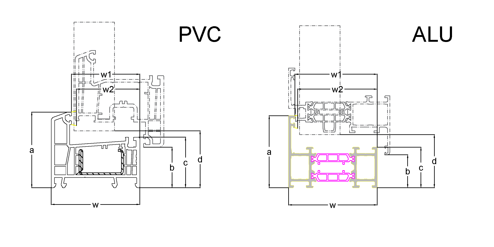
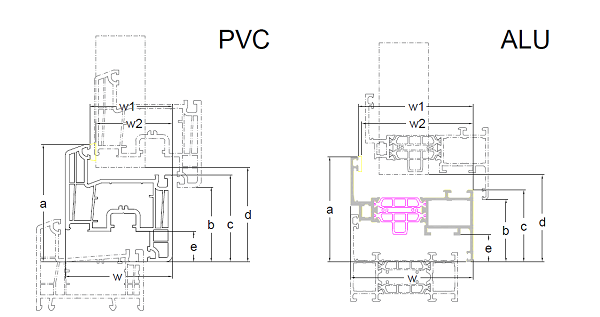
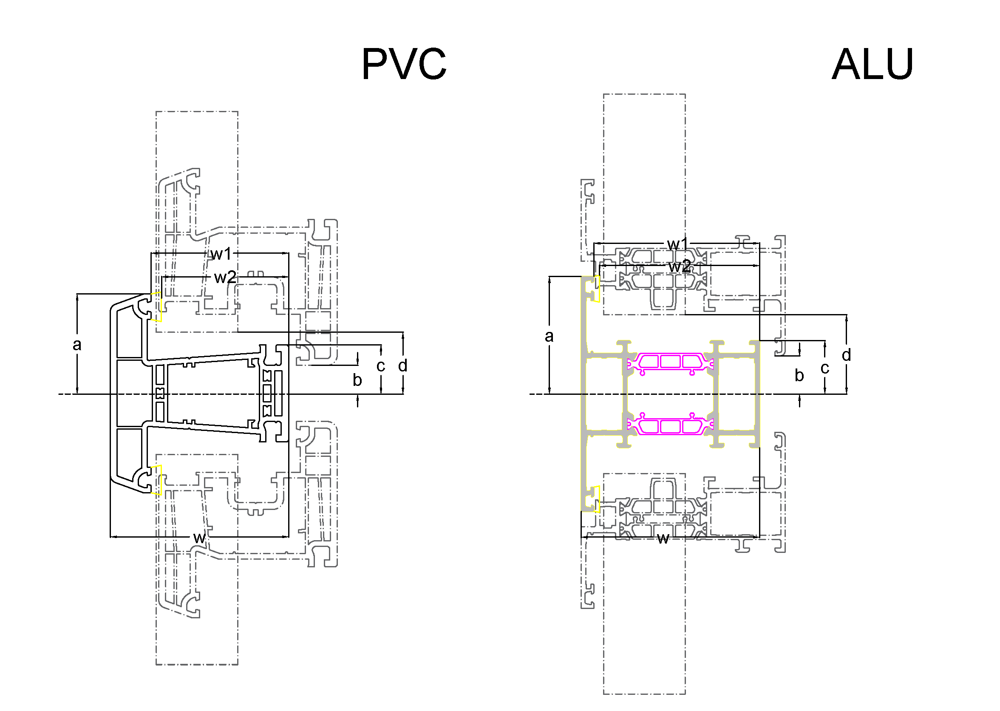
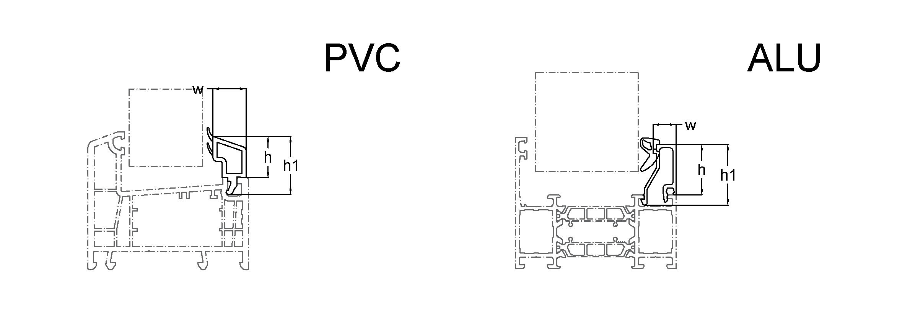

#### ProfileType Object

Объект, определяющий тип объекта [Profile](#профиль) с точки зрения назначения для производства оконных блоков и конструкций 

##### Object values 

В спецификации определены следующие возможные типы [Profile](#профиль):

- Рама
  
  
  
  Размеры объекта

  | Размер | Описание |
  | :-----:|:---------|
  | a | Высота |
  | b | Перекрытие створки |
  | c | Внутренняя высота |
  | d | Размер стеклопакета |
  | w | Системная глубина |
  | w1 | Размер по фальцу |
  | w2 | Размер по фальцу с учетом коэкструдированного / протянутого уплотнения |

- Створка открывание вовнутрь

  

  Размеры объекта

  | Размер | Описание |
  | :-----:|:---------|
  | a | Высота |
  | b | Перекрытие створки |
  | c | Внутренняя высота |
  | d | Размер стеклопакета |
  | f | Высота наплава со стороны фурнитурного паза |
  | w | Системная глубина |
  | w1 | Размер по фальцу |
  | w2 | Размер по фальцу с учетом коэкструдированного / протянутого уплотнения |

- Створка открывание наружу

- Импост

  

  Размеры объекта

  | Размер | Описание |
  | :-----:|:---------|
  | a | Высота |
  | b | Перекрытие створки |
  | c | Внутренняя высота |
  | d | Размер стеклопакета |
  | w | Системная глубина |
  | w1 | Размер по фальцу |
  | w2 | Размер по фальцу с учетом коэкструдированного / протянутого уплотнения |

- Штапик



  Размеры объекта

  | Размер | Описание |
  | :-----:|:---------|
  | h | Высота в профиле|
  | h1 | Высота общая  |
  | w | Ширина  |

- Армирование


  Размеры объекта

  | Размер | Описание |
  | :-----:|:---------|
  | h | Высота |
  | w | Ширина  |
  | d | Толщина |

- Штульп


#### Profile Object

Это объект, описывающий профили, применяемы для изготовления оконных конструкций [Construction](#конструкции) и [Window](#окна)

##### Fixed Fields

| Field Name                                   |                     Type                     | Description                                                                                                                                                                                                                           |
| -------------------------------------------- | :------------------------------------------: | ------------------------------------------------------------------------------------------------------------------------------------------------------------------------------------------------------------------------------------- |
| <a name="profileId"></a>id                  |                    `number`                    | **REQUIRED**. ID элемента, используется для ссылки из связанных объектов                         |
| <a name="profileType"></a>profileType                  |                    [Profileype Object](#profileTypeObject)                    | **REQUIRED**. Тип профиля, см. описание объекта ProfileType                         |


##### Profile Object Example

```json
{
    "id": 123,
    "profileType": "Рама"
}
```
